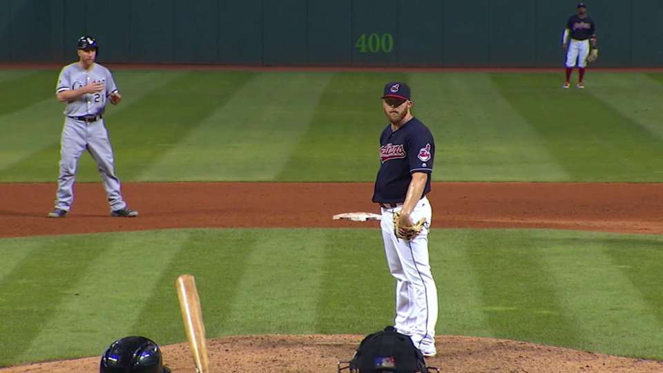
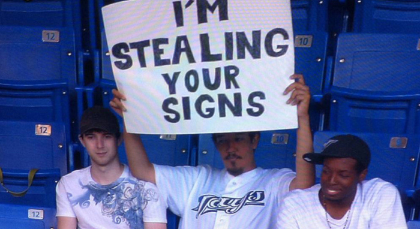

# Predicting Pitch Speed in MLB

With the Astros in the news every other week being attacked for allegedly stealing signs, it seems important that we somehow explore the advantage of knowing what pitch is coming.  Armed with this knowledge, could Houston hitters know not only what pitch was coming, but also the exact speed for which they should gear up?  This code makes use of historical stats and pitcher trends to examine that question.






Database creation is similar to that in <a href="http://github.com/mattgrcia/home_run_predictor">this project</a>.

#### Install

From your command line or Terminal (MacOS):

```
git clone https://github.com/mattgrcia/home_run_predictor
```

#### Required Software

<a href="http://www.r-project.org/">R</a>

<a href="http://www.python.org/downloads/">Python</a>

<a href="https://www.ffmpeg.org/">FFmpeg</a>

<a href="https://opencv.org/">OpenCV</a>

#### Recommended

<a href="http://rstudio.com/products/rstudio/">RStudio</a>

<a href="http://jupyter.org/install">Jupyter Notebook</a>

### Fast Track

1. Create master data sheet in <i>R</i> using <b>data/create_master.Rmd</b>.

2. Train and select model in <i>Python</i> using <b>training/class_model.ipynb</b>.

3. Generate matchups in <i>Python</i> using <b>predictions/create_matchups.ipynb</b>.

4. Combine pitcher and hitter stats in <i>R</i> using <b>predictions/create_matchups.Rmd</b>.

5. Generate predictions in <i>Python</i> using <b>predictions/automated_predictions.ipynb</b>.


### Detailed Pipeline

#### Data Collection

##### Stats

```
Main file - data/create_master.Rmd
```

Using the <a href="http://github.com/cpsievert/pitchRx">pitchRx</a> package, a database is created with the information on every pitch within the selected date range.  From this information, outcomes (singles, doubles, flyouts, etc.) in order to determine stats.  Basic, advanced, and split stats are created, as well as hot zone statistics.  A hot zone graph looks like this:


Each pitcher and hitter has a slugging percentage in each zone.  These are ranked by zone, creating a psuedo-power center profile for each player.

Once all stats are collected, each player has a profile for that season.

The same process is then run (without the stats collection) to get all atbats for the next season.  Pitchers and hitters are matched up to have a complete view of each atbat with each player's stats from the previous season.  Knowing the handedness of the pitcher and hitter allows us to select the relevant split stats.  The hot zone profiles are matched up using the sum of the squared error for zone ranks (think the higher the number, the less the zones match up).  Intuitively, a closer hot zone match would mean a greater chance of success for the hitter.

##### Pitcher Movement

```
Main file - data/pitcher_movement.py

Modules -
gif_scrape.py
gif_rename.py
gif_to_pic.py
pitcher_detector.py
```

In addition to these statistics more grounded in "normal" measurements, an additional feature is added to account for a pitcher's horizontal movement in his delivery.  Looking back on highlights from 50 years ago, it seems most pitchers ended in a good fielding position, but also threw significantly slower.  Could this extra motion be affecting pitch speed?

Here is a great example, as Jeurys Familia ends his slider falling off the mound.
  


First, video footage must be obtained for each pitcher.  Luckily, <a href="http://pitcherlist.com/">Pitcher List</a> has a collection of gifs for each pitcher's repertoire.  The links to all of these <a href="http://gfycat.com">gfycat</a> gifs are scraped using Selenium and Beautiful Soup in the module <i>gif_scrape.py</i>.  Since these are videos hosted online, <i>gif_rename.py</i> pust the links into a downloadable format and <i>pitcher_movement.py</i> converts them to their true gif format using <a href="http://ffmpeg.com">FFmpeg</a>.  These are then converted into frames in the module <i>gif_to_pic.py</i>.  OpenCV is then called upon to detect the pitcher throughout his motion, though we are most interested in his starting and ending position.  These are found with the <i>pitcher_detector.py</i> module; the center of the rectangular detector is taken for both points and subtracted in the x-direction to estimate overall horizontal motion.  All the steps listed are contained in <b>pitcher_movement.py</b>, which will output a dataframe of pitcher names matched with their average horizontal motion for each pitch type, sent to <i>pitcher_movement.csv</i>.
  
There is code in <b>create_master.Rmd</b> to pull in <i>pitcher_movement.csv</i> and integrate it into the stats for each pitcher.

This consitutes our master data set and it is exported for training and testing.


#### Model Training

```
Main file - training/trad_model.ipynb
Optional file - training/gbm_model.ipynb
```

Now that you have a data set ready for training, you have some options in terms of modeling.  Optionally, you can choose to train a gradient-boosted model (XGBoost in this case).  The optional file will allow you to tune hyperparameters and select a model to save.  The main file will allow you to train the following sci-kit learn models:

<a href="http://scikit-learn.org/stable/modules/generated/sklearn.linear_model.LinearRegression.html">Linear Regression</a>

<a href="https://scikit-learn.org/stable/modules/generated/sklearn.linear_model.Lasso.html">Lasso</a>

<a href="https://scikit-learn.org/stable/modules/generated/sklearn.linear_model.Ridge.html">Ridge</a>

<a href="https://scikit-learn.org/stable/modules/generated/sklearn.linear_model.ElasticNet.html">Elastic Net</a>

Of course, you can add to this list by appropriately importing and adding a model to <i>scaled_models</i> or <i>unscaled_models</i>.


#### Predicting

```
File 1 - predictions/create_matchups.ipynb
File 2 - predictions/create_matchups.Rmd
File 3 - predictions/generate_predictions.ipynb
```

### Further Implementation

To make this more scalable, stats should be left in and pulled from a SQL database, rather than my showcasing the ability to use R and Python.
